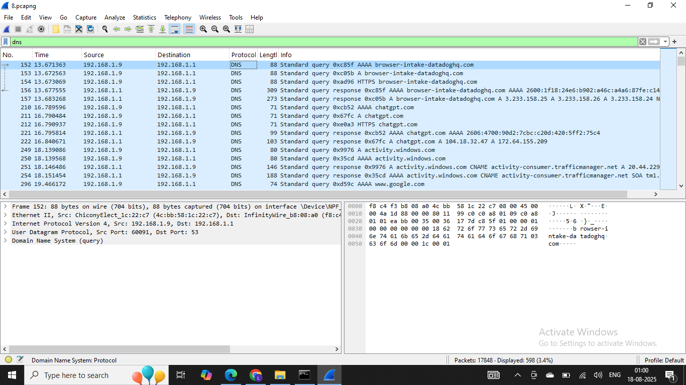
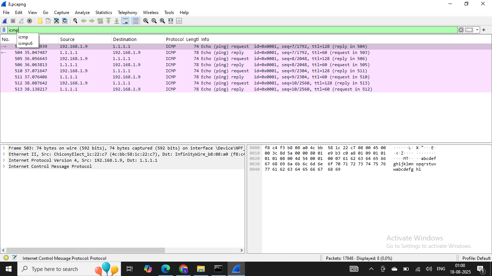
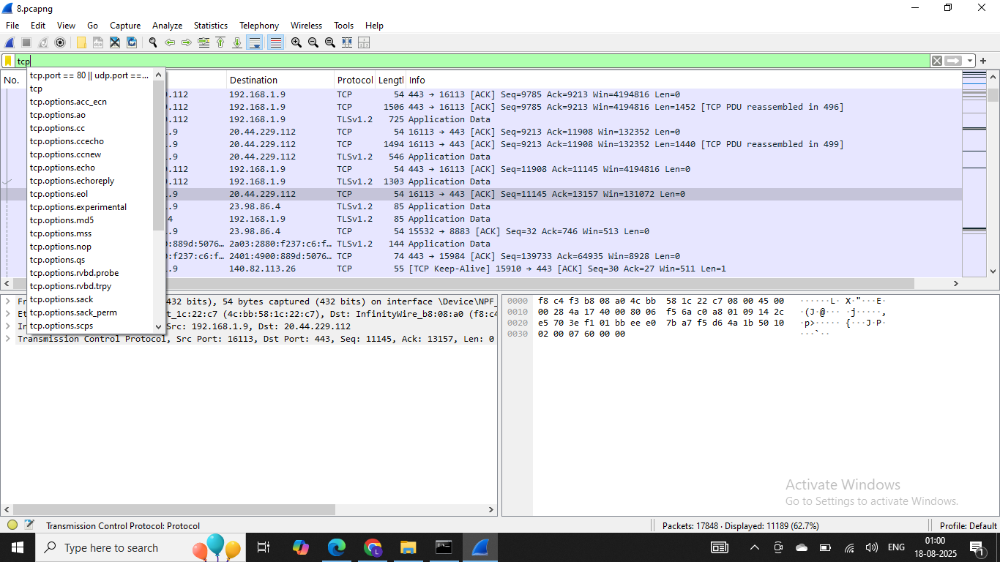

# network-traffic-capture
Captured and analyzed DNS, ICMP, and TCP/TLS traffic using Wireshark, applied filters to study protocol behavior, and documented findings with screenshots and notes.
# Task 5 – Wireshark Capture & Basic Analysis

**Date/Time:** 14–18 Aug 2025  
**Interface Used:** Wi-Fi (192.168.1.9 ↔ 192.168.1.1)  
**Host OS:** Windows 10

---

## 1. Traffic Generation
During the capture, I generated network traffic using:
- **Web browsing** (opened sites like `openai.com`, `chatgpt.com`, `windows.com`, `google.com`)
- **Ping (ICMP)** to external IP `1.1.1.1`
- **DNS lookups** automatically triggered by browser and system requests

---

## 2. Protocols Identified
At least three protocols were observed:

1. **DNS (Domain Name System)**  
   - Queries and responses for domains like:
     - `browser-intake-datadoghq.com`
     - `chatgpt.com`
     - `activity.windows.com`
     - `google.com`  
   - Example: Query for `chatgpt.com` returned both **AAAA** (IPv6) and **A** (IPv4) records.

2. **ICMP (Internet Control Message Protocol)**  
   - Ping requests from `192.168.1.9 → 1.1.1.1`
   - Replies from `1.1.1.1 → 192.168.1.9`
   - Each request/reply pair carried **sequence numbers** and **TTL values**, confirming connectivity.

3. **TCP (Transmission Control Protocol)**  
   - TCP connections from the local host to port **443** (HTTPS/TLS traffic).  
   - Observed:
     - **3-way handshake** (SYN, SYN/ACK, ACK) establishing connections
     - Encrypted **TLSv1.2 Application Data** packets  
   - Example: `192.168.1.9:16113 → 20.44.229.112:443`

---

## 3. Filters Applied
The following Wireshark display filters were used to isolate protocols:

---

## 4. Interesting Packets
- **DNS**:  
  - Packet #152: Query `browser-intake-datadoghq.com`  
  - Packet #221: Response `chatgpt.com → 104.18.32.47, 172.64.155.209`
- **ICMP**:  
  - Packet #503: Echo request `192.168.1.9 → 1.1.1.1`  
  - Packet #504: Echo reply `1.1.1.1 → 192.168.1.9`
- **TCP**:  
  - Packet #490–492: TCP 3-way handshake  
  - Packets #495–499: TLS Application Data

---

## 5. Screenshots
- **DNS packets:**   
- **ICMP packets:**   
- **TCP packets:** 

---

## 6. Takeaways
- DNS is critical for resolving domain names before communication.
- ICMP confirmed basic connectivity with external hosts.
- Most actual content was carried over **TLS-encrypted TCP traffic**, demonstrating how modern browsing hides payloads while still exposing metadata (IPs, ports, handshake).
- Wireshark provides a clear breakdown of how multiple protocols work together in normal internet usage.

---
